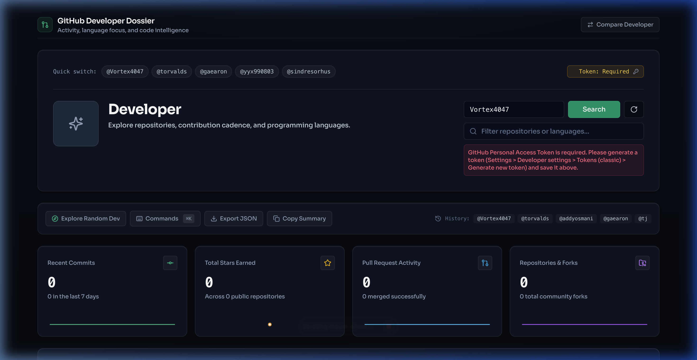
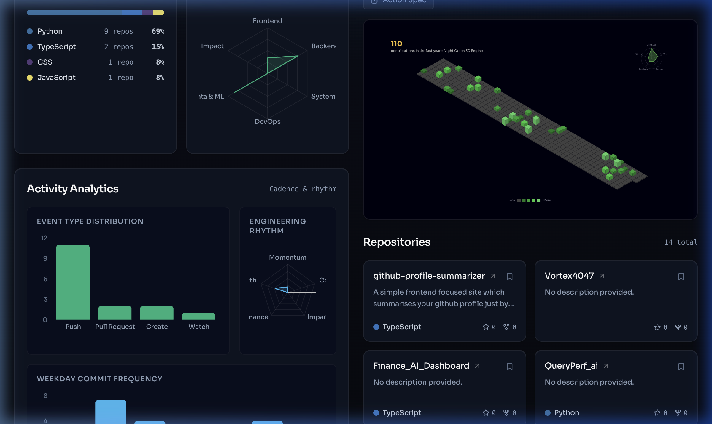
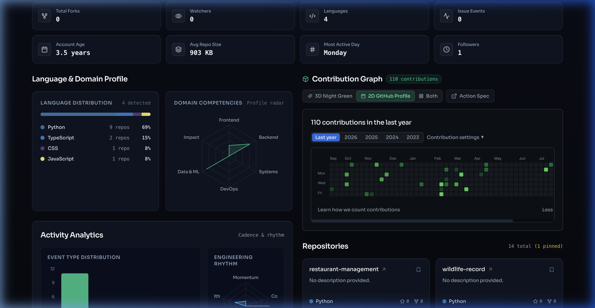
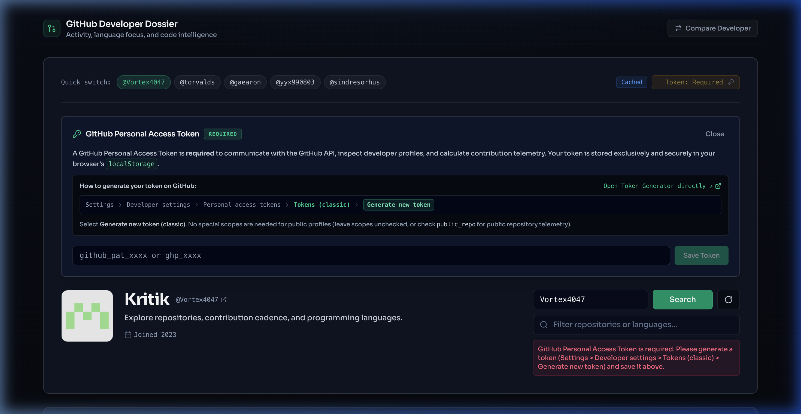

<div align="center">

# 🧬 GitHub Profile Summarizer & Intelligence Terminal

<p align="center">
  <strong>A high-performance, obsidian-themed developer dossier that transforms any GitHub profile into an interactive engineering dashboard — featuring 53-week 3D isometric contribution models, authentic profile heatmaps, skill domain radar analytics, and live API telemetry.</strong>
</p>

[](https://react.dev/)
[](https://www.typescriptlang.org/)
[](https://vitejs.dev/)
[](https://tailwindcss.com/)
[](https://vortex4047.github.io/github-profile-summarizer/)
[](LICENSE)

<br/>



<br/><br/>

[**Explore Live Demo ↗**](https://vortex4047.github.io/github-profile-summarizer/) &nbsp;•&nbsp; [**Report Bug**](https://github.com/Vortex4047/github-profile-summarizer/issues) &nbsp;•&nbsp; [**Request Feature**](https://github.com/Vortex4047/github-profile-summarizer/issues)

</div>

---

## 🌟 Key Highlights

### 1. 🧊 3D Contribution Graph (Night Green Engine)
Inspired by the renowned [yoshi389111/github-profile-3d-contrib](https://github.com/yoshi389111/github-profile-3d-contrib), the dynamic 3D isometric engine models your entire 53-week calendar in an authentic Night Green palette:
- **True Isometric Depth Occlusion**: Correct back-to-front rendering so front pillars naturally occlude distant blocks.
- **Logarithmic Pillar Heights**: Pillar heights dynamically scale according to contribution volume using `Math.log10(count / 20 + 1) * 144 + 4`.
- **Replay Growth Animation**: Smooth SVG transform transitions demonstrating pillar growth across time.
- **Telemetry Radar**: Integrated top-right developer activity radar tracking Commits, Pull Requests, Issues, Code Reviews, and Stars.

<div align="center">
  
</div>

<br/>

### 2. 📅 Authentic 2D GitHub Profile Calendar
Matches your official GitHub profile contribution calendar down to the pixel:
- **Full Year 53-Week Grid**: Accurate dates, levels, and counts matching your live profile.
- **Multi-Year Navigation**: Seamlessly toggle between `Last year`, `2026`, `2025`, `2024`, and `2023`.
- **Interactive Tooltips**: Hover over any cell to see exact dates and contribution quantities.
- **Dual-View Switcher**: Instantly switch between **3D Night Green**, **2D GitHub Profile**, or **Both** in a split layout.

<div align="center">
  
</div>

<br/>

### 3. 🔑 Secure Token Configuration with Built-In Guide
To power unrestricted 5,000 req/hr rate limits and detailed contribution collection, the dashboard features a streamlined token onboarding modal:
- **Visual Breadcrumb Guide**: Direct step-by-step path:
  `Settings` > `Developer settings` > `Personal access tokens` > `Tokens (classic)` > `Generate new token`
- **1-Click Direct Link**: Jump straight to the GitHub token creation page.
- **Strictly Client-Side**: Tokens are stored exclusively in your browser's local storage and are never transmitted to any third-party server.

<div align="center">
  
</div>

---

## 🚀 Features at a Glance

| Feature | Description |
| :--- | :--- |
| 🔍 **Profile Search & Quick Switch** | Instant search for any GitHub developer, with 1-click quick-switch chips (`@Vortex4047`, `@torvalds`, `@gaearon`, etc.). |
| 🧊 **3D Isometric Engine** | 53-week 3D contribution graph with Night Green palette, pillar growth animation, and activity radar. |
| 📅 **2D Classic Heatmap** | Pixel-accurate GitHub profile calendar with multi-year selectors (`2026`, `2025`, `2024`, `2023`, `Last Year`). |
| 📈 **Domain Competency Radar** | Multi-axis analysis mapping skills across Frontend, Backend, Systems, DevOps, and Data & ML. |
| 🎨 **Language Spectrum Bar** | Proportional language breakdown rendered with official GitHub syntax highlight colors. |
| 📦 **Smart Repository Bento** | Filter by forks, sort by stars/recency, search keywords, and pin favorites persistently. |
| ⚖️ **Side-by-Side Comparison** | Compare any two developers head-to-head on repositories, stars, languages, and cadence. |
| ⌨️ **Command Dock (⌘K)** | Global keyboard shortcuts: `Cmd/Ctrl + K` for actions, `Shift + R` for surprise profiles, and JSON snapshot exports. |
| ⚡ **Smart Cache & Telemetry** | Session caching with live header telemetry displaying remaining API quotas in real time. |

---

## 🛠️ Tech Stack

- **Frontend Framework**: [React 18](https://react.dev/) + [TypeScript](https://www.typescriptlang.org/)
- **Build System**: [Vite 6](https://vitejs.dev/)
- **Styling**: [Tailwind CSS 4](https://tailwindcss.com/) + Custom Obsidian Design Tokens
- **Icons**: [Lucide React](https://lucide.dev/)
- **Charts & Geometry**: [Recharts](https://recharts.org/), D3 Math Utilities, and Custom SVG Isometric 3D Projection
- **Deployment**: [GitHub Pages](https://pages.github.com/) via GitHub Actions

---

## 🏁 Getting Started

### Prerequisites
- **Node.js** (v18.0 or higher recommended)
- **npm** or **pnpm**

### Installation

```bash
# 1. Clone the repository
git clone https://github.com/Vortex4047/github-profile-summarizer.git
cd github-profile-summarizer

# 2. Install dependencies
npm install

# 3. Launch local dev server
npm run dev
```

Visit `http://localhost:5173/github-summarizer/` in your browser.

### Production Build

```bash
# Build optimized production bundle
npm run build

# Preview production build locally
npm run preview
```

---

## 🔑 GitHub Personal Access Token (Setup Guide)

To query the GitHub API with full 5,000 requests/hour and render detailed contribution statistics:

1. Go to [GitHub Token Generator](https://github.com/settings/tokens/new) (or navigate: **Settings** > **Developer settings** > **Personal access tokens** > **Tokens (classic)** > **Generate new token**).
2. Set a descriptive Note (e.g. `GitHub Profile Summarizer`).
3. Set an expiration period.
4. **Scopes**: No special scopes are needed for public profiles and repos (you may leave all scopes unchecked, or select `public_repo`).
5. Click **Generate token**, copy the `ghp_xxxx` key, and paste it into the dashboard's token drawer.

---

## ⌨️ Keyboard Shortcuts

| Shortcut | Action |
| :--- | :--- |
| `Cmd / Ctrl + K` | Open Quick Command Palette |
| `Shift + R` | Load a random developer profile |
| `Escape` | Close modals and drawers |

---

## 📄 Attributions & Credits

- 3D contribution algorithm and geometry inspired by **[yoshi389111/github-profile-3d-contrib](https://github.com/yoshi389111/github-profile-3d-contrib)** under the MIT License.
- Language colors sourced from the official [GitHub Linguist](https://github.com/github-linguist/linguist) dataset.
- UI Design crafted with anti-slop guidelines inspired by **Leonxlnx/taste-skill** and **ui-ux-pro-max**.

---

<div align="center">

Made with 💚 by [**@Vortex4047**](https://github.com/Vortex4047)

</div>
